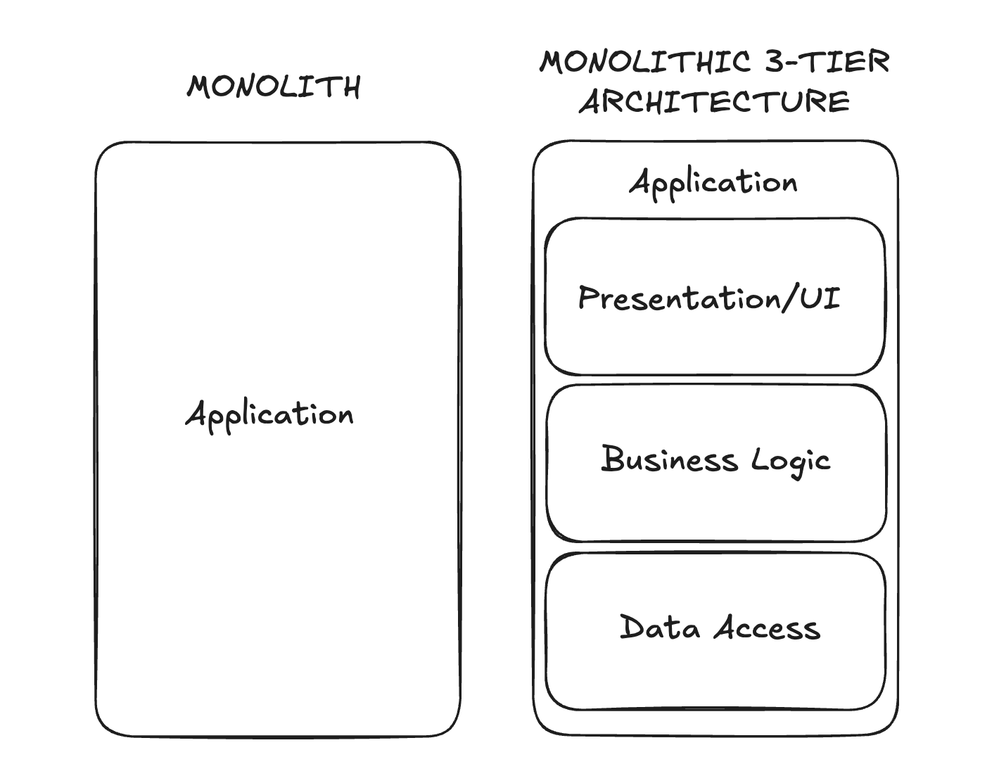
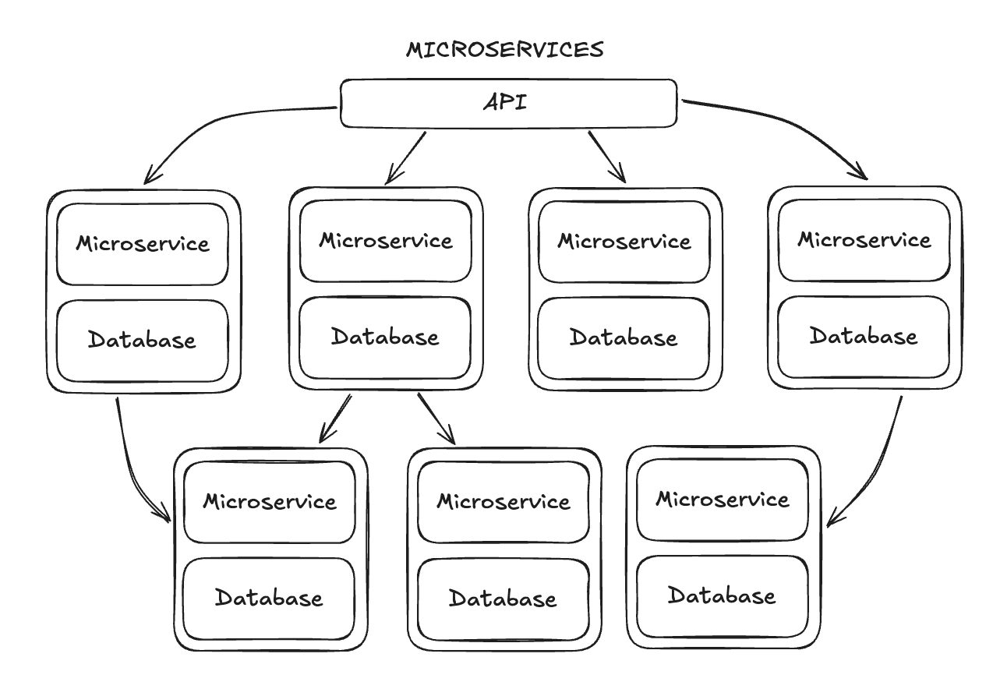

# Monolith

Deployed as one single "big block". Self-contained and independent.

## Pro Et Contra

### Positives

- Relatively simple development, low cost, quick to build. Very convenient (less time and resources needed).
- Easy deployment (self-contained): fewer parts, therefore fewer components to manage/fix
- Uncomplex structure: quicker/simpler testing and easier depugging.
- Single unit communication means better data security.

### Negatives

- Lack of elasticity: Restrictive updates, difficult to adopt new tech/languages/frameworks
- Fault tolerance: High dependence means downtime difficulties.
- Scalability: Hard to maintain/handle new changes. Whole system needs to be redeployed.
- Difficult to distribute development due to indivisible database.
  - each team has different agendas (what and when to add)
  - coordination/timing headaches due to shared code/deployment
  - often a mismatch between how various parts wish to be deployed and arranged

## Example uses

- If the software application is designed to perform a single service.
- If product won't need future scaling. Monolothic architecture keeps it simple and cost-effective
- good choice for smaller programs that need to be quick and cheap. E.g. for start ups: Apps can be put together rapidly with little resources.

## Variant: N-tier

3-tiers: Presentation/UI; Businesss Logic; Data

Variation of a monolith but with more flexibility: deploy different tiers at different time scales, scale up diff tiers independently from other tiers

## Diagram

## Comparison: Micro-Service

Creates a larger appliaction out of multiple modular services—can be time and resource consuming.

Coordination layer on top: API gateway, allows modular services to communicate—increased complexity: that which were coordinated in the same memory space/process needs to be coordinated across networks

Each service is independently deployable, with independent databases and coding—complicated deployment but can scale up infinitely.

Allows for independent updating, testing, deployment, scaling—testing is complex and can be expensive and time-consuming: all parts must be tested, and then must also test that all parts work together properly.

Example uses:

- Restructuring of legacy systems: allows for incremental optimisation and improvements without too much downtime or resource expenditure
- Real-time data streaming/processing services: streaming/online banking/ ecommerce etc.

excalidraw link: https://excalidraw.com/#json=QQkBY3yb5oISLHbkSpyCh,Mkn3m58cxeeSDFnymI_q5g
